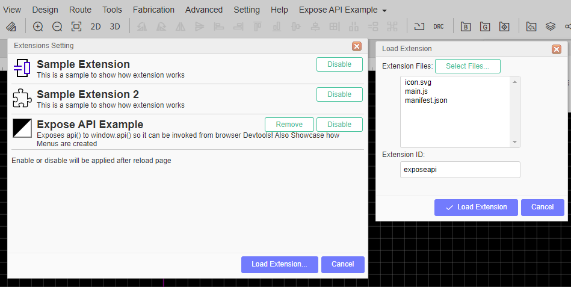
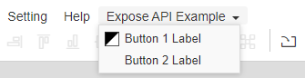
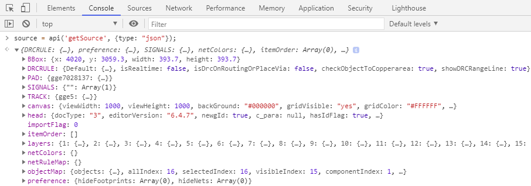

EasyEDA Extension Example
=========================
Download this code, open [EasyEDA](https://easyeda.com/editor), go to "Advanced" > "Extensions" > "Extensions Settings ..." > "Load Extension..." > "Select Files ..." > Select all three files from the "extension" directory > "Load Extension".

The extension should now be loaded like this:

See code for details.

As a Bonus, this Extension exposes the internal api() to the browsers window-Object, so api() can be called from devtools!

